# Cropora — System Design Presentation (25 Slides)

> **What this file is.** The complete slide-by-slide blueprint for a **25-slide, visual-first
> presentation** of the Cropora system. It explains the system *design perspective* only: how the
> pipelines exist, how components are connected, how requests travel between them, and how every
> piece is unified into one product. It deliberately **does not explain code** or individual
> implementation details.
>
> **How to render.** Each `## SLIDE n` block is one slide. Diagrams are written in **Mermaid** —
> paste them into any Mermaid-compatible slide tool (Marp, Slidev, mermaid.live, draw.io import,
> or PowerPoint + Mermaid add-in) to render them as images. The **MOTION** line under each slide
> describes the build/animation step order for tools that support animated reveals (PowerPoint
> Morph, Google Slides transitions, Slidev clicks, Keynote builds).

## Global visual language (apply to every slide)

| Meaning | Style |
|---|---|
| Android app (on device) | 🟩 Green nodes / fills |
| Backend API (cloud) | 🟦 Blue nodes / fills |
| ML model artifacts | 🟧 Orange nodes / fills |
| Local storage / bundled assets | ⬜ Grey nodes / fills |
| External actors (user, camera, network) | 🟪 Purple nodes / fills |
| Runtime request/response flow | Solid arrow → |
| Build-time / bundled / prerequisite flow | Dashed arrow ⇢ |
| Decision points | Diamond shape |
| The single shared contract | Thick gold border on the node |

**Motion grammar used throughout the deck:**
1. Nodes fade in first (left → right, or top → bottom).
2. Arrows then *draw themselves* in the direction of data flow (wipe animation).
3. A single 🔵 pulse dot travels along the active arrow to represent a request in flight.
4. Parallel branches animate simultaneously; converging branches animate into the shared node together.
5. The slide's "hero" element (named in each MOTION line) pulses once at the end.

---
---

# PART 1 — THE BIG PICTURE (Slides 1–5)

## SLIDE 1 — Title: One Leaf, One System

**TEXT (minimal):**
```text
CROPORA
Plant-Disease Detection — A System Design Walkthrough

One photo. Two engines. One answer.
```

**VISUAL:**
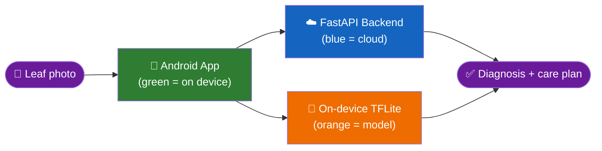

**MOTION:** Hero background = darkened app screenshot. The four nodes fade in clockwise; the pulse
travels `Leaf → App`, then **splits** to Cloud and Edge simultaneously, then both converge on
"Diagnosis". Title fades in last. *Hero element: the split pulse.*

---
## SLIDE 2 — The Problem & The One-Sentence Design Answer

**TEXT:**
```text
A farmer photographs a leaf. The system must answer:
"What disease, how sure, and what do I do next?"
— online or offline, with one consistent answer format.

Design answer: ONE pipeline with TWO interchangeable inference engines
behind ONE shared response contract.
```

**VISUAL:**
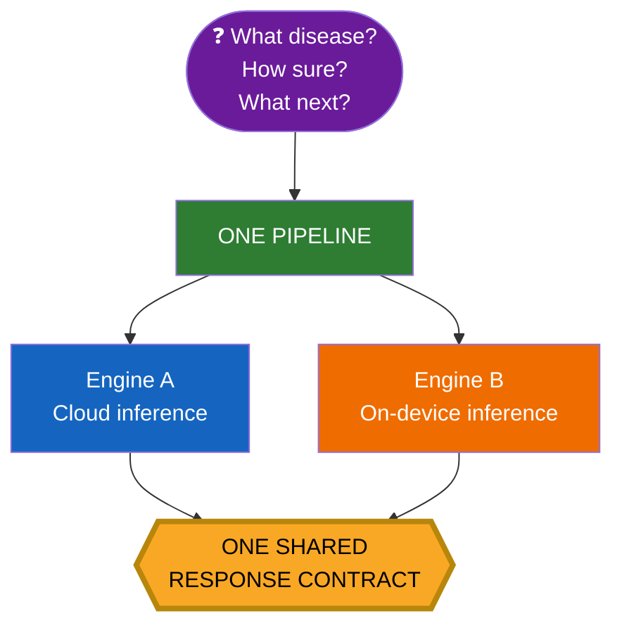

**MOTION:** Question card drops in → "ONE PIPELINE" grows → the two engine cards slide out left
and right in parallel → both arrows wipe simultaneously into the gold contract diamond, which
pulses. *Hero: the gold contract diamond.*

---
## SLIDE 3 — The System at 10,000 Feet

**TEXT:**
```text
Three worlds, one system:
  DEVICE  → capture, choose engine, on-device inference, local memory
  CLOUD   → high-power inference service
  ASSETS  → the models & knowledge both worlds share
```

**VISUAL:**
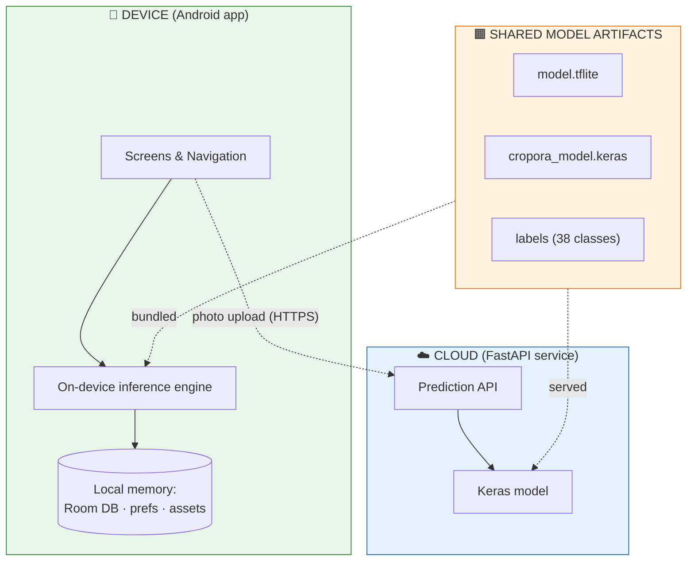

**MOTION:** Three world-containers fade in (Device → Cloud → Artifacts). Solid arrows animate
(runtime), then dashed arrows animate last with a different color to show "bundled at build time".
*Hero: the dashed vs solid arrow reveal.*

---
## SLIDE 4 — The Eight-Stage Master Pipeline (deck map)

**TEXT:**
```text
Every request in Cropora travels these 8 stages:
1 Capture → 2 Route → 3 Infer → 4 Unify → 5 Gate → 6 Present → 7 Persist → 8 Revisit
```

**VISUAL:**
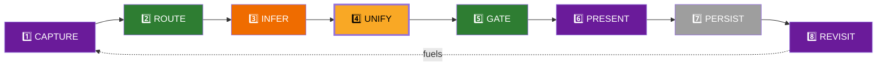

**MOTION:** This ribbon is the deck's navigation device — it reappears as a mini progress bar on
every later slide with the current stage highlighted. Nodes pop in one-by-one left to right; the
return loop dashes in last. *Hero: the S8→S1 feedback loop.*

---
## SLIDE 5 — Design Principles That Hold the System Together

**TEXT:**
```text
1. CONTRACT-FIRST  — both engines emit the same 8-field prediction object
2. OFFLINE-FIRST   — full value without any network
3. LOCAL MEMORY    — history & analytics never leave the device
4. SAFE DEGRADATION— mock mode, validation, health checks, "uncertain" flag
5. SINGLE SOURCE OF TRUTH — one label set, one guidance dataset, one schema
```

**VISUAL:**
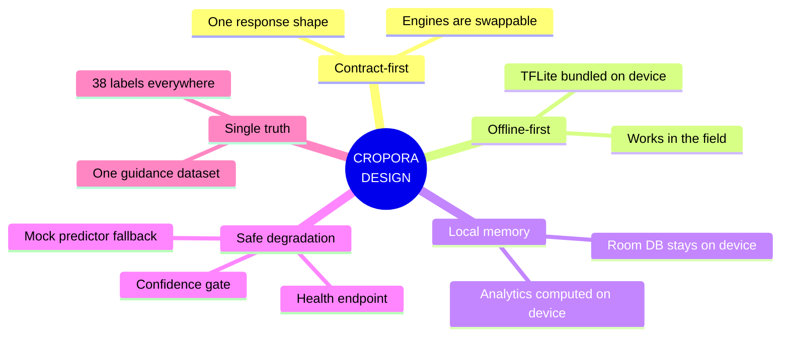

**MOTION:** Mindmap branches grow outward one principle at a time (5 builds); each branch pulses
as its text line highlights. *Hero: root node.*

---
---

# PART 2 — THE ENTRY PIPELINE (Slides 6–8)

## SLIDE 6 — Stage 1 · Capture: Two Doors Into the System

**TEXT:**
```text
Every diagnosis begins with an image arriving through one of two doors:
📷 Camera   |   🖼️ Gallery
Both doors produce the same thing: a content URI — the system's unit of work.
```

**VISUAL:**
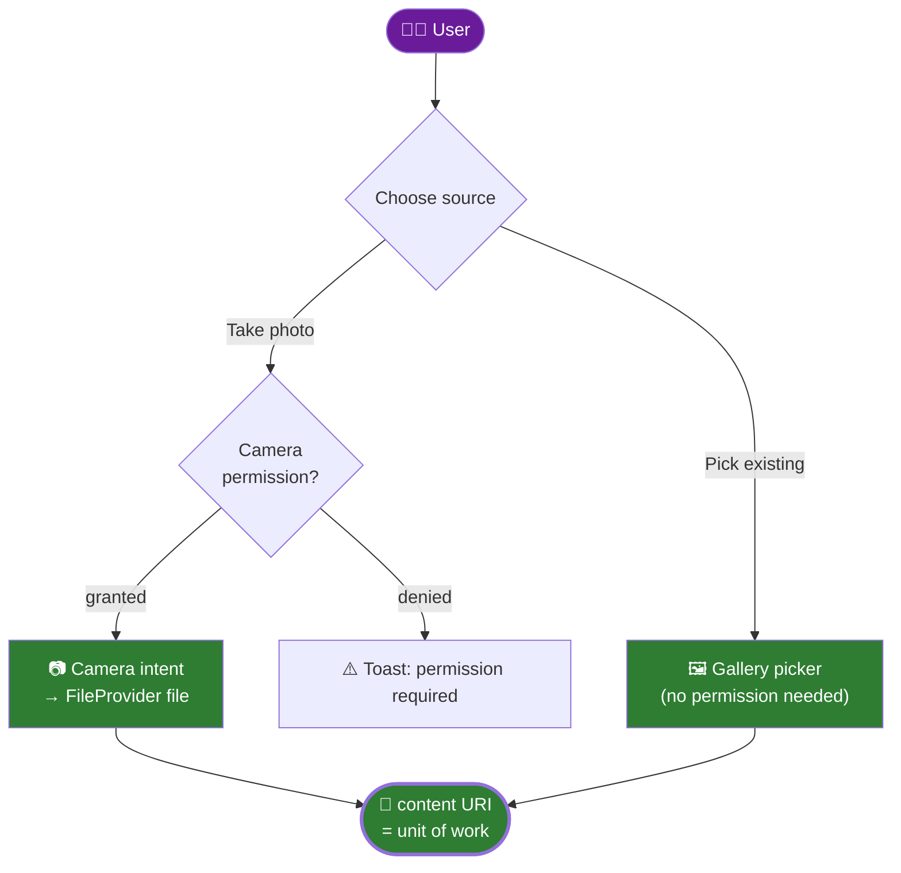

**MOTION:** User icon drops in → decision diamond appears → the two branch paths animate in
parallel; the permission sub-branch on the camera path builds one step later. Both paths' arrows
converge on the URI node simultaneously, and the URI node pulses. *Hero: URI convergence.*

---
## SLIDE 7 — The App's Nervous System: Screens & Navigation

**TEXT:**
```text
Five tabs share one bottom navigation bar:
Home · Scan · Analytics · Library · Settings
Scan and Result are the pipeline spine; the other tabs are read-only views
over what the pipeline produced.
```

**VISUAL:**
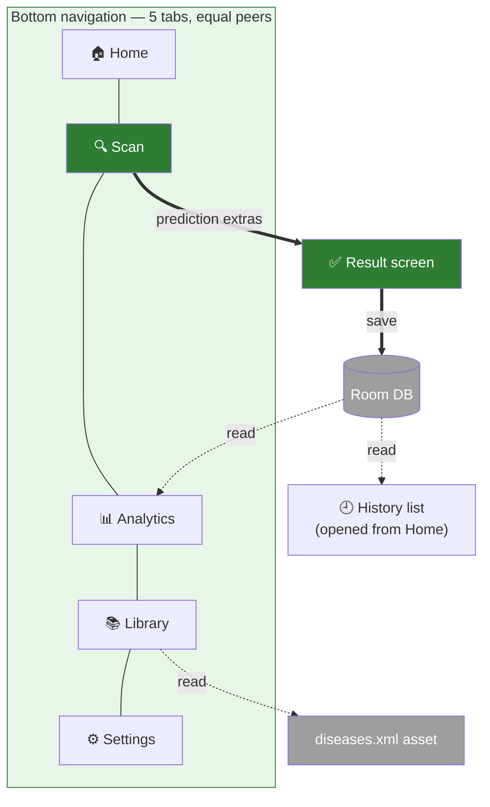

**MOTION:** The five tab pills pop in left-to-right, then the thick "spine" arrows Scan→Result→DB
draw themselves, then the thin dashed read-arrows appear to show the side tabs are *consumers* of
pipeline output. *Hero: the Scan→Result→DB spine.*

---
## SLIDE 8 — Stage 2 · Route: The Fork in the Road

**TEXT:**
```text
One toggle decides which engine the same photo visits:
☁️ CLOUD  → the photo travels to the FastAPI service
📱 OFFLINE → the photo never leaves the device
The rest of the pipeline is identical either way.
```

**VISUAL:**
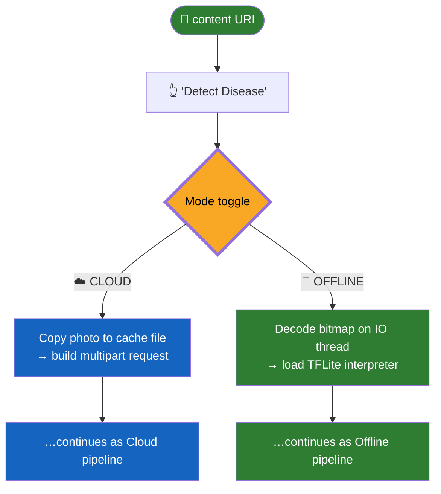

**MOTION:** URI and button fade in → fork diamond scales up → **both** branch cards slide out
simultaneously (visual proof of symmetry) → arrows wipe down both paths in parallel. The fork
diamond pulses. *Hero: symmetric parallel branch reveal.*

---
---

# PART 3 — THE TWO INFERENCE PIPELINES (Slides 9–13)

## SLIDE 9 — Stage 3a · The Cloud Pipeline, Hop by Hop

**TEXT:**
```text
Device → network → service → model → JSON. Five hops, one request.
```

**VISUAL:**
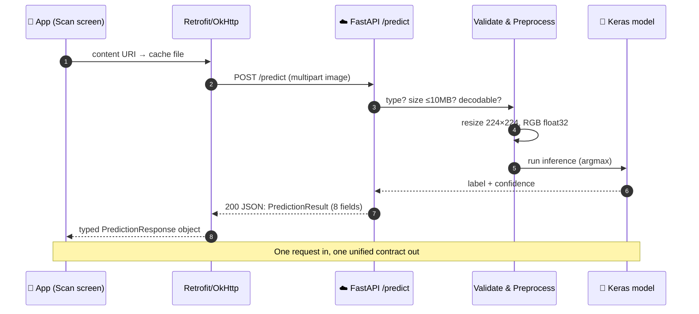

**MOTION:** Lifelines fade in, then messages draw one at a time in number order (the numbers
double as the animation build order). A moving pulse travels with each arrow. The closing note
wipes in last. *Hero: message 8 returning to the app.*

---
## SLIDE 10 — Stage 3a (cont.) · Inside the Cloud Service

**TEXT:**
```text
The backend is a thin, guarded shell around the model:
Guards (400 / 413 / 503) → Preprocess → Predict → Enrich → Contract
```

**VISUAL:**
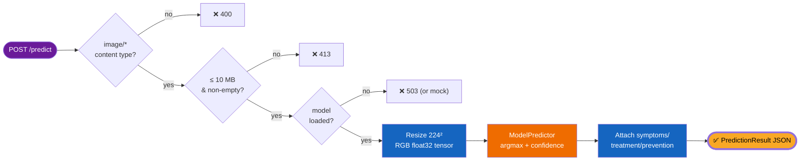

**MOTION:** The three guard diamonds cascade in first (with red error exits popping off each),
then the happy-path chain draws left→right, and the gold output node pulses. *Hero: guard cascade.*

---
## SLIDE 11 — Stage 3b · The Offline Pipeline: The Same Journey, Zero Network

**TEXT:**
```text
The offline path mirrors the cloud path step-for-step —
every stage just happens inside the phone.
```

**VISUAL:**
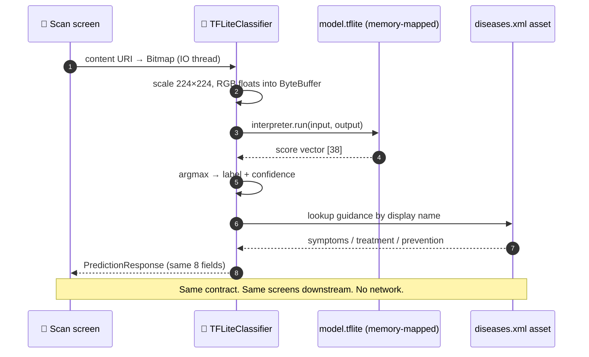

**MOTION:** Same choreography as Slide 9 so the audience *feels* the mirror symmetry — messages
animate in the same rhythm. Side-by-side playback with Slide 9 is recommended (split-screen
transition). *Hero: message 8 — identical object returning.*

---
## SLIDE 12 — The Twin Contract: How Two Engines Become One System

**TEXT:**
```text
THE UNIFYING IDEA
Both engines emit the SAME 8-field prediction object:
model_label · disease · confidence · uncertain
guidance_available · symptoms · treatment · prevention
Downstream screens can't tell (and don't care) which engine answered.
```

**VISUAL:**
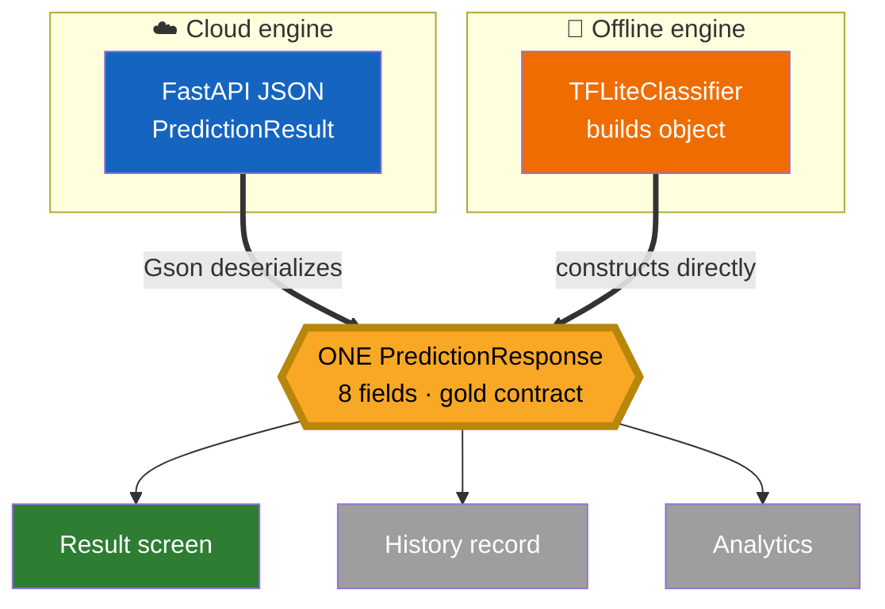

**MOTION:** The two engine boxes slide in from opposite edges; both thick arrows wipe into the
gold contract **at the same time**; the contract pulses, then the three downstream consumers fan
out. This is the deck's central visual moment. *Hero: gold contract node.*

---
## SLIDE 13 — Two Models, One Brain: Shared Model Artifacts

**TEXT:**
```text
One trained model ships in two forms:
  ☁️ cropora_model.keras  → served by the backend
  📱 model.tflite         → bundled in the app (memory-mapped)
Both sides enforce the same shape: 224×224×3 in → 38 scores out.
Preprocessing lives INSIDE the model, so both paths feed raw RGB.
```

**VISUAL:**
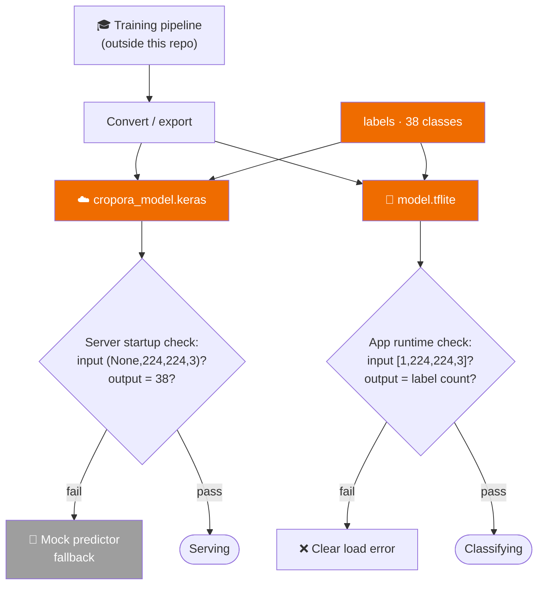

**MOTION:** The export fan-out animates first (one brain → two forms), then both validation
diamonds build in parallel, then the pass/fail exits pop. *Hero: the parallel validation reveal.*

---
---

# PART 4 — THE POST-INFERENCE PIPELINE (Slides 14–17)

## SLIDE 14 — Stage 5 · The Confidence Gate

**TEXT:**
```text
No prediction is shown raw. Both engines pass one gate:
confidence below the user's threshold → "uncertain" wrapper
(relabel + guidance to re-capture / consult an expert)
Threshold is user-tunable in Settings (default 50%).
```

**VISUAL:**
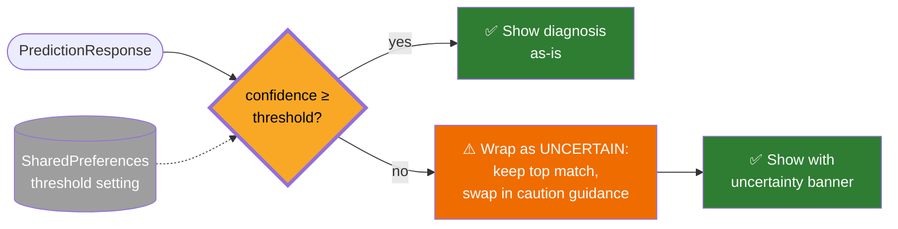

**MOTION:** The prediction dot travels in, hits the diamond, and the diamond *flips* to reveal
whichever branch is live (demonstrate the "no" branch first for drama, then replay with "yes").
The prefs arrow dashes in last. *Hero: the flipping gate.*

---
## SLIDE 15 — Stage 6 · Present: One Screen, Any Engine

**TEXT:**
```text
The Result screen is a pure renderer:
it receives 6 intent extras and displays them.
It has no idea which engine, model, or network produced them.
Actions on this screen: 📤 Share   💾 Save to History   🏠 Home
```

**VISUAL:**
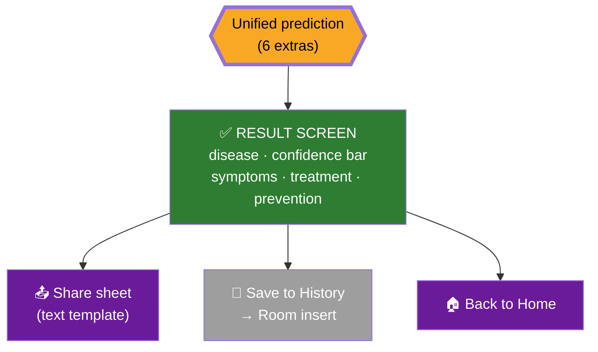

**MOTION:** The contract card drops into the result screen card (a "slotting in" animation — the
key visual metaphor of the whole deck), then the three action buttons fan out. *Hero: the slot-in.*

---
## SLIDE 16 — Stage 7 · Persist: Local Memory (Room)

**TEXT:**
```text
Saving a scan writes ONE row to the on-device Room database
(table: scan_history): disease, confidence, guidance, image URI,
location placeholder, timestamp.
Nothing leaves the phone. History survives restarts.
```

**VISUAL:**
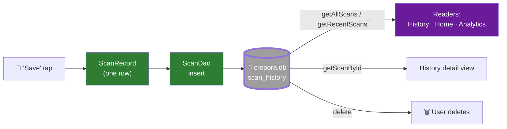

**MOTION:** Write path (left→DB) animates first in solid arrows; then read paths radiate out of
the DB as dashed arrows — visually separating *writes* from *reads*. *Hero: the DB hub.*

---
## SLIDE 17 — Stage 8 · Revisit: History, Analytics, Library

**TEXT:**
```text
The stored data feeds three read-only loops — all computed on-device:
🕘 HISTORY — every saved scan, newest first, detail view, delete
📊 ANALYTICS — total scans · average confidence · most frequent disease
📚 LIBRARY — bundled diseases.xml: symptoms/treatment/prevention reference
```

**VISUAL:**
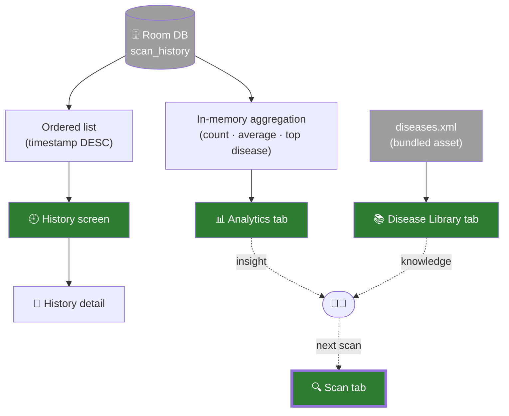

**MOTION:** Three read-loops animate one after another (DB→Analytics, DB→History, XML→Library),
then the dotted loop back to "Scan tab" draws itself, closing the product cycle. *Hero: the
closing loop back to Scan.*

---
---

# PART 5 — THE CONNECTIONS (Slides 18–20)

## SLIDE 18 — The Request/Response Journey in One Picture

**TEXT:**
```text
One scan, both worlds, full round-trip.
```

**VISUAL:**
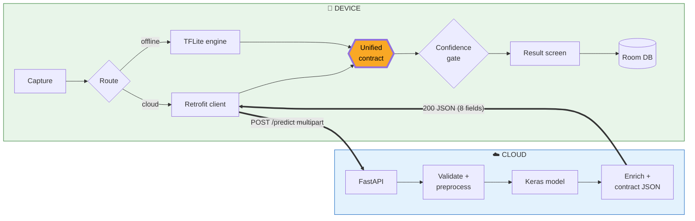

**MOTION:** The pulse travels the full journey in one continuous animation: Capture → Route →
(splits briefly at the fork) → cloud hop crosses the device/cloud boundary with a distinct
"network whoosh" → returns → gate → result → DB. *Hero: the boundary-crossing pulse.*

---
## SLIDE 19 — The Configuration Backbone

**TEXT:**
```text
Two small config planes steer the whole system — no rebuilds needed:
📱 SharedPreferences — backend URL · confidence threshold
☁️ .env — model path · image size · threshold · CORS · mock switch · port
```

**VISUAL:**
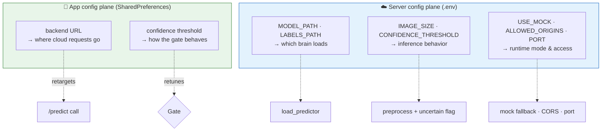

**MOTION:** Two config planes fade in side by side; each dashed influence-arrow draws outward to
the runtime element it steers, one at a time. *Hero: six steering arrows completing.*

---
## SLIDE 20 — Failure Is a Designed Path

**TEXT:**
```text
Every link has a planned fallback — the system degrades, it doesn't die:
🛟 no TensorFlow / bad model file → mock predictor keeps the API alive
🔌 network down / API error → offline mode still fully works
📉 low confidence → "uncertain" wrapper instead of a wrong confident answer
🚫 permission denied / bad upload / oversize image → clear 4xx + toast
```

**VISUAL:**
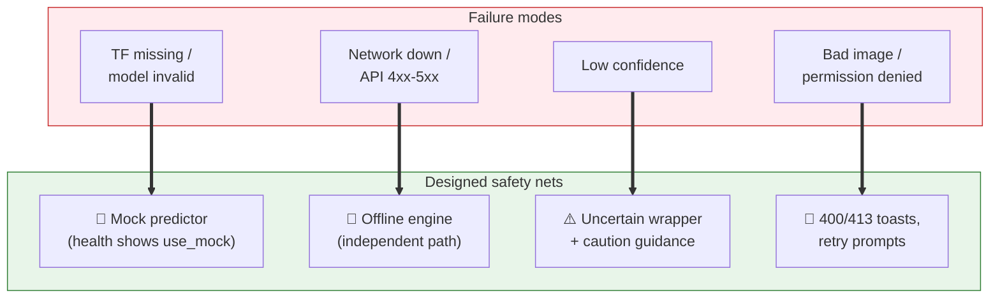

**MOTION:** Red failure cards slide in from the left with a shake; each green safety card then
"grows a shield" over its failure, one pair at a time. End state: all four shielded. *Hero: the
four shield reveals.*

---
---

# PART 6 — DELIVERY & UNITY (Slides 21–25)

## SLIDE 21 — How Each Side Ships

**TEXT:**
```text
☁️ Backend → Docker image (slim Python, uvicorn, /health check built in;
  TensorFlow optional at build time for lightweight mock images)
📱 App → Gradle release build — BLOCKED unless a real, valid model.tflite
  (TFL3 magic bytes) and exactly 38 unique labels are present
```

**VISUAL:**
```mermaid
flowchart LR
    subgraph BE["☁️ Backend delivery"]
        CODE1["FastAPI source"] --> IMG["Docker build<br/>(INSTALL_TENSORFLOW flag)"]
        IMG --> RUN["uvicorn :8000<br/>+ container HEALTHCHECK"]
    end
    subgraph FE["📱 App delivery"]
        CODE2["Kotlin source"] --> GRAD["Gradle release build"]
        GATE2{"validateReleaseModel:<br/>TFL3 header?<br/>38 labels?"} 
        GRAD --> GATE2
        GATE2 -->|"fail"| STOP["🛑 Build fails<br/>(no silent bad release)"]
        GATE2 -->|"pass"| APK["✅ APK/AAB"]
    end

    style BE fill:#e3f2fd,stroke:#1565c0
    style FE fill:#e8f5e9,stroke:#2e7d32
    style GATE2 fill:#f9a825,color:#000,stroke-width:3px
```

**MOTION:** Two delivery lanes animate in parallel, top and bottom; the app lane *stops* at the
gate, shows the red "build fails" card, then replays to green — the build-time guard made visible.
*Hero: the release gate replay.*

---
## SLIDE 22 — Data Residency: Where Every Byte Lives

**TEXT:**
```text
ON DEVICE (persistent): scan history DB · settings · bundled model & library
ON DEVICE (transient):  camera files, upload cache copies (deleted after send)
IN TRANSIT:             one multipart image upload per cloud scan
ON SERVER:              nothing stored — image is processed in memory and discarded
```

**VISUAL:**
```mermaid
flowchart TB
    subgraph PHONE["📱 PHONE — where data lives"]
        KEEP["🗄️ Persistent:<br/>cropora.db · prefs · assets"]
        TEMP["⏳ Transient:<br/>captures · cache uploads<br/>(auto-deleted)"]
    end
    WIRE[["🌐 IN TRANSIT<br/>1 image per cloud scan<br/>(deleted after response)"]]
    subgraph SERVER["☁️ SERVER — stateless"]
        MEM["🧠 In-memory only:<br/>tensor → prediction<br/>→ response → gone"]
    end
    TEMP <--> WIRE
    WIRE <--> MEM

    style PHONE fill:#e8f5e9,stroke:#2e7d32
    style SERVER fill:#e3f2fd,stroke:#1565c0
    style KEEP fill:#9e9e9e,color:#fff
    style TEMP fill:#9e9e9e,color:#fff
    style MEM fill:#1565c0,color:#fff
```

**MOTION:** A photo byte-icon spawns in "Transient", crosses the wire, gets *consumed* in server
memory (icon dissolves), the response travels back, and the transient file vanishes (fade-out) —
while the "Persistent" store stays solidly lit. *Hero: the dissolving server-side image.*

---
## SLIDE 23 — Everything Converges: The Unified System

**TEXT:**
```text
ONE capture → ONE router → TWO engines → ONE contract →
ONE gate → ONE result → ONE memory → ONE user loop.
That is the whole system.
```

**VISUAL:**
```mermaid
flowchart TB
    U(["🧑‍🌾 User"]) --> CAP["1 Capture"]
    CAP --> RTR{"2 Route"}
    RTR --> CLD["☁️ Cloud engine"]
    RTR --> OFF["📱 Offline engine"]
    CLD ==> CON{{"3 ONE CONTRACT"}}
    OFF ==> CON
    CON --> GATE{"4 Gate"}
    GATE --> RES["5 Result"]
    RES --> MEM[("6 Local memory")]
    MEM --> LOOP["7 History · Analytics · Library"]
    LOOP -.->|"informs next scan"| U

    style CON fill:#f9a825,color:#000,stroke:#b8860b,stroke-width:5px
    style CLD fill:#1565c0,color:#fff
    style OFF fill:#ef6c00,color:#fff
    style RES fill:#2e7d32,color:#fff
    style MEM fill:#9e9e9e,color:#fff
    style LOOP fill:#2e7d32,color:#fff
```

**MOTION:** The full pipeline re-animates end-to-end as a summary replay — the two engine arrows
converge on the gold contract together, then the loop back to the user closes with a dashed draw.
Final pulse travels the entire closed loop once. *Hero: the closed loop.*

---
## SLIDE 24 — Honest Boundaries of the Current System

**TEXT:**
```text
Designed-in limits (engineering honesty, not bugs):
• Model artifacts (model.tflite / .keras) are not in this repo — they are prerequisites
• Guidance text curated for 10 of the 38 classes (others get safe generic guidance)
• Cloud mode targets HTTP/LAN deployments (HTTPS/TLS is a deployment concern)
• Tabs are separate screens with a shallow back stack (no per-tab history yet)
• Location fields exist in the schema but are not yet captured
```

**VISUAL:**
```mermaid
flowchart LR
    subgraph NOW["✅ Solid today"]
        A["Dual-engine pipeline"]
        B["Unified contract"]
        C["Local memory + analytics"]
        D["Safe degradation"]
    end
    subgraph NEXT["🔭 Natural next steps"]
        N1["Ship trained artifacts"]
        N2["Grow guidance to 38/38"]
        N3["HTTPS + auth on API"]
        N4["Per-tab back stacks"]
        N5["Geo-tag scans"]
    end
    NOW ==>|"roadmap"| NEXT

    style NOW fill:#e8f5e9,stroke:#2e7d32
    style NEXT fill:#e3f2fd,stroke:#1565c0
```

**MOTION:** Green "solid" cards lock in with a stamp effect; blue "next" cards then slide out of
each corresponding green card like drawers opening. *Hero: drawers opening.*

---
## SLIDE 25 — Close: One Photo, One Answer

**TEXT:**
```text
CROPORA
A leaf goes in. A care plan comes out.
Two engines. One contract. One system.

Questions?
```

**VISUAL:**
```mermaid
flowchart LR
    L(["🌿"]) ==> SYS["CROPORA<br/>SYSTEM"] ==> A(["✅🌱"])
    style SYS fill:#2e7d32,color:#fff,stroke-width:5px
```

**MOTION:** Replay the Slide-1 signature animation (pulse splits to both engines and converges)
at 3× speed as the closing flourish; title text fades in over it. End on the 🌿 → ✅🌱 emoji
diagram. *Hero: the 3× replay.*

---
---

## Appendix — Rendering instructions

1. **Slide count check:** sections contain exactly 25 `## SLIDE n` blocks (1–25). Do not merge or split.
2. **Mermaid rendering:** every fenced ` ```mermaid ` block renders standalone in Marp (`marp: true`
   header), Slidev, mermaid.live, or the draw.io Mermaid importer. Export each diagram as PNG/SVG
   and place it as the slide's dominant visual (~70% of the canvas); the TEXT block sits in a slim
   side/bottom band.
3. **Animations:** the MOTION line maps to build order in PowerPoint (Animations pane), Google
   Slides (object animations), Slidev (`v-click`), or Keynote (Build In order). Where "pulse
   travels along an arrow" is specified, use a small circle shape with a motion path animation
   following the arrow.
4. **Color legend:** keep the Global Visual Language table on an appendix/hidden reference slide;
   the colors carry meaning across all 25 slides.
5. **Truthfulness:** this deck describes the system's *design and connections* as implemented in
   the repository. It makes no accuracy or performance claims, since the trained model artifacts
   are not part of the repository.
