# Cropora — System Design Presentation (12 Slides)

> **What this file is.** A simplified, visual-first walkthrough of how Cropora works — built for
> explaining to teachers, peers, and non-technical audiences. Each slide is one diagram + a short caption.
>
> **How to render.** Each `## SLIDE n` block is one slide. Paste any ` ```mermaid ` block into
> [mermaid.live](https://mermaid.live), Marp, Slidev, or PowerPoint + Mermaid add-in to get
> a rendered image. The **MOTION** line describes the animation hint for tools that support it.

## Global visual language (apply to every slide)

| Meaning | Color |
|---|---|
| Android app (on device) | 🟩 Green |
| Backend API (cloud) | 🟦 Blue |
| ML model | 🟧 Orange |
| Local storage / bundled assets | ⬜ Grey |
| User / camera / network | 🟪 Purple |
| The single shared answer contract | 🟨 Gold thick border |

---

## SLIDE 1 — Title

**TEXT:**
```text
CROPORA
Plant-Disease Detection

One photo. Two engines. One answer.
```

**VISUAL:**
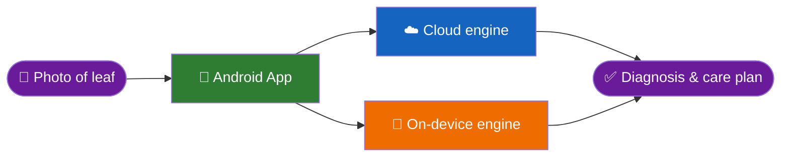

**MOTION:** Nodes fade in left → right; pulse travels Leaf → App → splits to both engines → merges into Answer.

---

## SLIDE 2 — The Problem

**TEXT:**
```text
A farmer photos a leaf.
The app must say: What disease? How sure? What to do?
— even with no internet.
```

**VISUAL:**
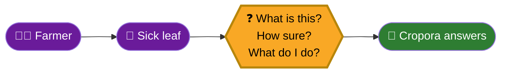

**MOTION:** Farmer and leaf appear → question box zooms in → answer card slides in from right.

---

## SLIDE 3 — The Big Picture

**TEXT:**
```text
Three worlds work together:
  📱 Device — captures, decides, stores
  ☁️ Cloud  — powerful inference
  📦 Assets — shared model & knowledge
```

**VISUAL:**
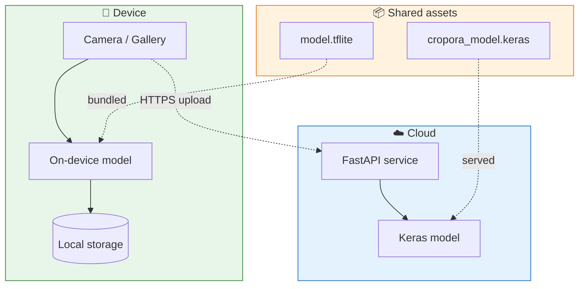

**MOTION:** Three containers fade in. Solid arrows (runtime) draw first; dashed arrows (build-time bundling) draw last.

---

## SLIDE 4 — The Journey in 7 Steps

**TEXT:**
```text
Every scan follows this path:
Capture → Route → Infer → Answer → Gate → Show → Save
```

**VISUAL:**
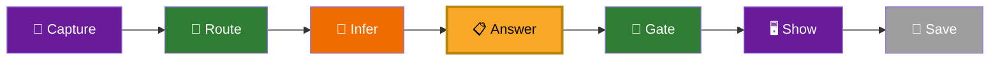

**MOTION:** Steps pop in one by one left to right.

---

## SLIDE 5 — Step 1 & 2: Capture & Route

**TEXT:**
```text
Photo comes in → app checks network → picks an engine.
Online? → Cloud.   Offline? → Phone answers by itself.
```

**VISUAL:**
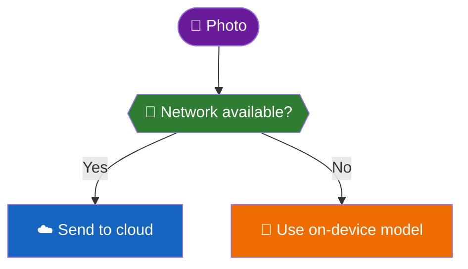

**MOTION:** Photo drops in → network check diamond appears → two branches slide out in parallel.

---

## SLIDE 6 — Step 3: The Two Inference Engines

**TEXT:**
```text
Cloud engine: FastAPI + Keras model (server-side, stateless, no image stored).
On-device engine: TFLite model memory-mapped on the phone (38 disease classes, 224×224 input).
Both produce the exact same answer format.
```

**VISUAL:**
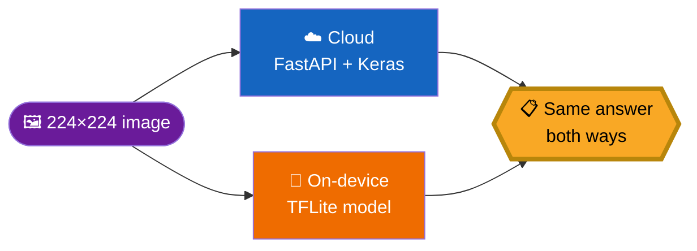

**MOTION:** Image appears → two engine boxes grow → both arrows converge onto the gold answer box, which pulses.

---

## SLIDE 7 — Step 4: The One Shared Answer (Hero Slide)

**TEXT:**
```text
No matter which engine ran, the answer is always these 8 fields.
```

**VISUAL:**
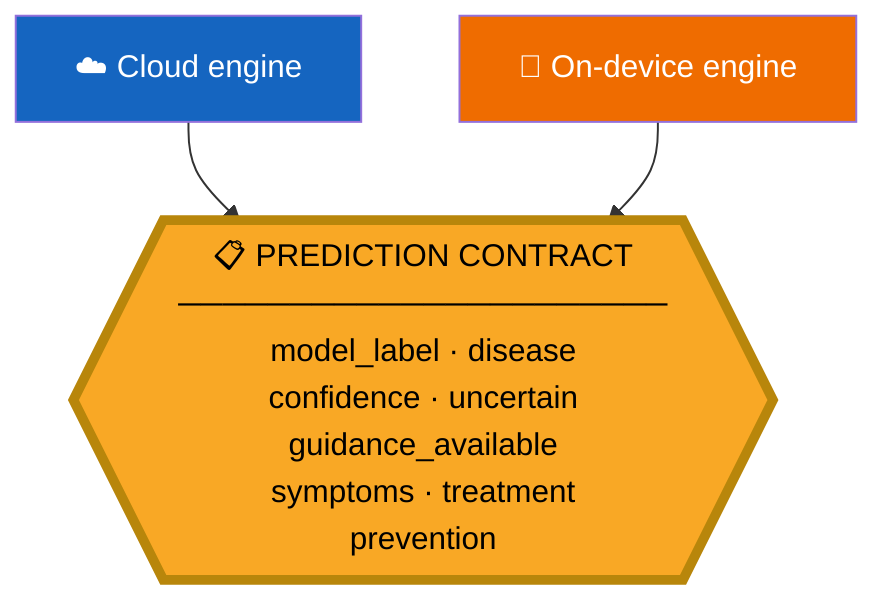

**MOTION:** Cloud and on-device boxes appear → both arrows converge → gold contract box zooms in and pulses twice.

---

## SLIDE 8 — Step 5: The Confidence Gate

**TEXT:**
```text
Low confidence? → marked "uncertain" and flagged to the user.
Default threshold: 50% (user can adjust).
```

**VISUAL:**
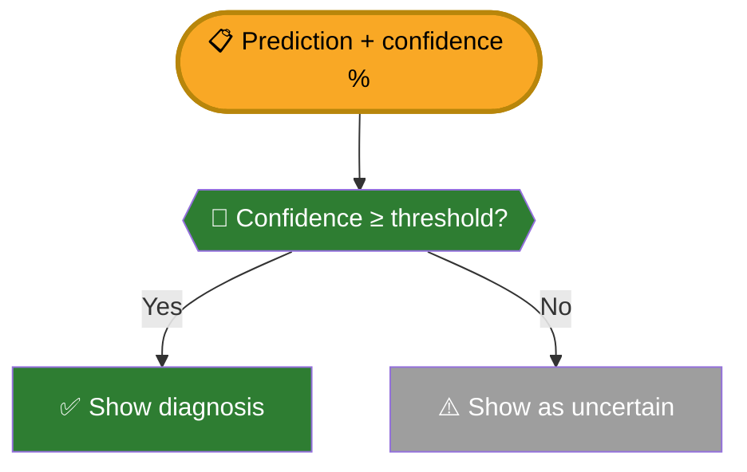

**MOTION:** Prediction card drops in → gate diamond lights up → two paths draw outward.

---

## SLIDE 9 — Step 6 & 7: Result Screen & Save

**TEXT:**
```text
Result screen shows disease name, confidence bar, symptoms, treatment, prevention.
User taps Save → stored in local database (never leaves the phone).
```

**VISUAL:**
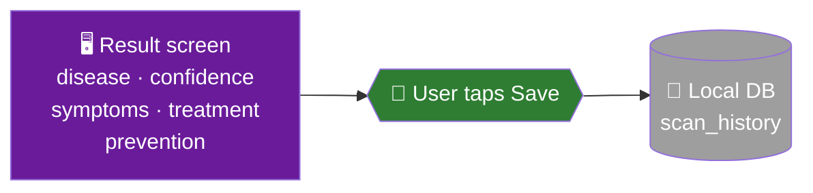

**MOTION:** Result screen slides in → Save button pulses → arrow draws into database cylinder.

---

## SLIDE 10 — Revisit: History, Analytics & Library

**TEXT:**
```text
Saved scans power three features — all local, no account needed.
```

**VISUAL:**
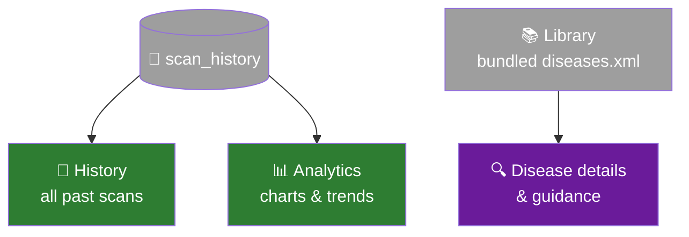

**MOTION:** Database cylinder appears → three feature cards fan out.

---

## SLIDE 11 — Safe Degradation

**TEXT:**
```text
If anything goes wrong, the app stays safe:
  • Cloud down → switch to on-device engine
  • Bad photo (too large / wrong format) → friendly error
  • Model missing at build time → Gradle build is blocked
```

**VISUAL:**
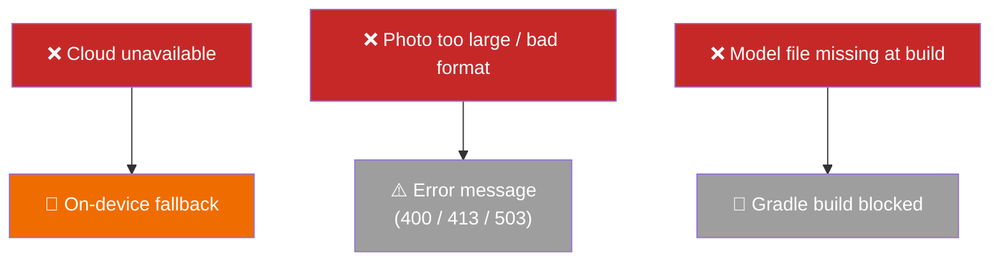

**MOTION:** Each failure row fades in one at a time, each with its safety response.

---

## SLIDE 12 — Full Journey in One Picture

**TEXT:**
```text
From leaf photo to saved result — the complete Cropora flow.
```

**VISUAL:**
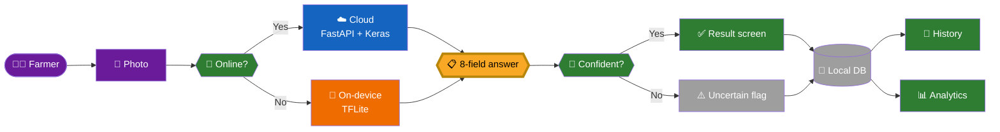

**MOTION:** Flow draws itself left to right, one node at a time, finishing with History and Analytics.

---

## Rendering Appendix

| Tool | How to use |
|---|---|
| **mermaid.live** | Paste any code block at [mermaid.live](https://mermaid.live) → copy as PNG/SVG |
| **Marp** | Use `marp --html` on this file; fenced mermaid blocks render automatically |
| **Slidev** | Paste blocks inside `<Mermaid>` tags or use the built-in mermaid plugin |
| **PowerPoint / Google Slides** | Render each diagram on mermaid.live → export PNG → insert as image |
| **draw.io** | File → Import → Mermaid syntax → auto-convert to editable diagram |
